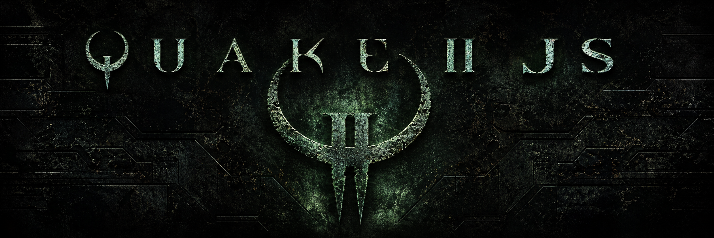

# Quake2JS

Quake2JS is a browser-focused TypeScript port of the original Quake II source code.

The project is based on id Software's original open-source release:
[id-Software/Quake-2](https://github.com/id-Software/Quake-2).

This port was coded with OpenAI Codex as a coding assistant for implementation, validation, and repository maintenance.

The goal is not to build a Quake-like game from scratch. The goal is to carry the original engine, game, client, server, file format, and renderer logic into a modern TypeScript codebase while keeping the source mapping as readable as possible.

## Status

This repository contains a browser-focused Quake II runtime with:

- TypeScript ports of the original `qcommon`, `client`, `server`, `game`, filesystem, memory, math, and binary format code.
- A web app entry point in `apps/web`.
- A Three.js renderer layer for the browser.
- A virtual filesystem able to mount Quake II `baseq2` assets, including `pak0.pak`.

The repository includes the Quake II demo/shareware `pak0.pak` so the browser build can run with redistributable demo content. Retail game data is not included.

## Repository Layout

```text
apps/
  web/                 Browser app

packages/
  client/              Client-side Quake II logic
  filesystem/          Quake II virtual filesystem and PAK mounting
  formats/             Binary format readers such as PAK, PCX, WAL, MD2, BSP-related data
  game/                Gameplay module port
  math/                Shared math primitives from the original code
  memory/              Low-level binary and buffer helpers
  platform/            Browser platform adapters
  qcommon/             Common engine layer
  renderer-common/     Renderer contracts shared by renderer backends
  renderer-three/      Three.js renderer implementation
  server/              Server runtime port
  shared/              Small shared utilities and metadata
```

## Quick Start

- Node.js 20 or newer
- npm

Play the demo/shareware build in your browser:

```text
https://karlos-fr.github.io/Quake-2-JS/
```

Install dependencies:

```bash
npm install
```

Start the development server:

```bash
npm run dev
```

Then open the Vite URL printed in the terminal, usually:

```text
http://localhost:5173/
```

The game is served from the root page. There is no separate demo page or alternate full-game page.

## Game Assets

The demo/shareware data pack is already included at:

```text
apps/web/public/baseq2/pak0.pak
```

This is enough to run the browser build with the demo/shareware maps.

To use retail assets locally, replace that file with your own legally obtained retail `baseq2/pak0.pak`. Optional cinematic files can also be placed under:

```text
apps/web/public/baseq2/video/
```

If the directory is missing in a fresh local experiment, create it with:

```bash
mkdir -p apps/web/public/baseq2
```

The app also supports local development paths, but `apps/web/public/baseq2` is the portable setup for GitHub users.

## Build

Run the TypeScript check:

```bash
npm run typecheck
```

Build the web app:

```bash
npm run build
```

The production output is generated by Vite under:

```text
apps/web/dist/
```

## Useful Commands

```bash
npm run dev        # Start the browser app in development mode
npm run build      # Build the browser app
npm run typecheck  # Run TypeScript without emitting files
```

## Porting Principles

Quake2JS keeps the original Quake II code as the source of truth.

The port favors:

- preserving original names where they help traceability;
- keeping behavior close to the C source before modernizing structure;
- separating runtime logic from browser adapters;
- keeping renderer-specific code in dedicated renderer packages;
- making binary parsing, filesystem behavior, networking structures, and game simulation explicit rather than hidden behind broad abstractions.

Browser, audio, input, storage, and Three.js integration live in adapter layers. Core engine and gameplay behavior should remain in the runtime packages.

## License

This project is a TypeScript port of the original Quake II source release. See the upstream project for the original source license:
[id-Software/Quake-2](https://github.com/id-Software/Quake-2).

The included `apps/web/public/baseq2/pak0.pak` is the Quake II demo/shareware data pack. Retail Quake II game data files are not included; you must provide your own legally obtained retail assets if you want to use them.
